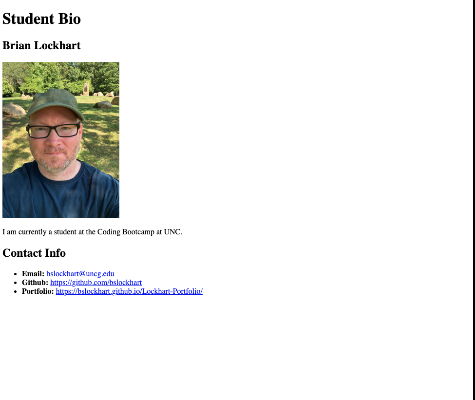

# 🏗️ Create a Webpage Using HTML
Work with a partner to implement the following user story:
* As a student, I want to create a biography page that includes an image, a paragraph about me, and my contact information.

## Acceptance Criteria
* It's done when the main header reads "Student Bio".
* It's done when there is a section that includes a name, an image, and a paragraph.
* It's done when there is a second section that includes a subheader labeled "Contact Info" and a list that includes links to my email, GitHub, and portfolio.
* It's done when the finished page matches the mockup.

## Mockup
* The following image demonstrates the web application's appearance and functionality:
* Unsolved Application Appearance.

* Solved Application appearance.

## 💡 Hints
How can you use header elements to define the most important heading and the subheaders? How does using different header elements impact the size of the text?
Refer to the [Full-Stack Blog HTML Cheatsheet](https://coding-boot-camp.github.io/full-stack/html/html-cheatsheet).

## 🏆 Bonus
If you have completed this activity, work through the following challenge with your partner to further your knowledge:
* What are the advantages of using semantic HTML elements?
Use [Google](https://www.google.com) or another search engine to research this.
1. The semantic HTML tags help the search engines and other user devices to determine the importance and context of web pages.
2. The pages made with semantic elements are much easier to read.
3. It has greater accessibility. It offers a better user experience.

## Submission
[Biography Page](https://bslockhart.github.io/Class-Activity-01-HTML)

---